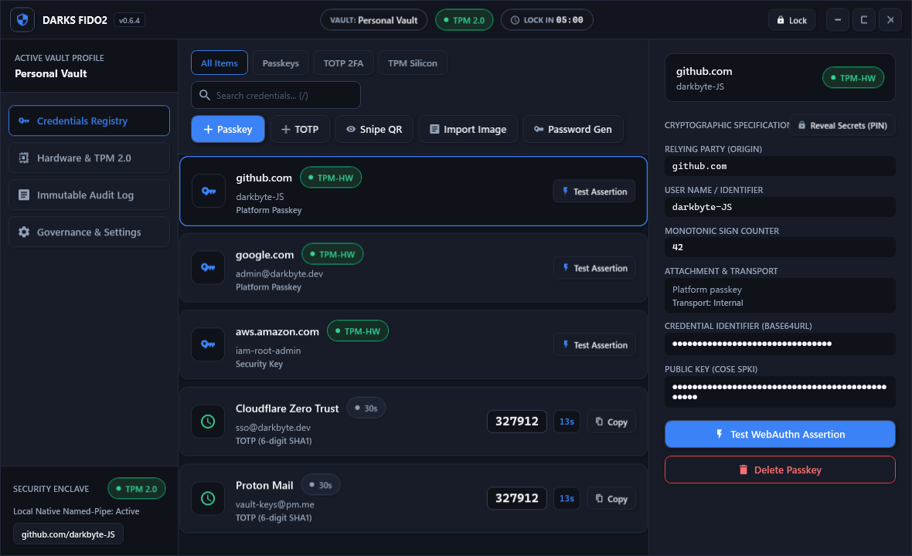

<p align="center">
  
</p>

# Darks FIDO2 (v0.6.4)

**Windows 11 FIDO2 / WebAuthn Authenticator, Hardware-Backed Passkey Provider, and TOTP Manager.**

[](https://github.com/darkbyte-JS/DarksFIDO2/actions/workflows/ci.yml)
[](https://github.com/darkbyte-JS/DarksFIDO2/releases)
[](LICENSE)
[](docs/COMPATIBILITY.md)
[](docs/ARCHITECTURE.md)

> **Note:** Binaries are signed using the project development certificate (`CN=Darkbyte. INC`). Verify SHA-256 checksums before installing.

[Download v0.6.4](https://github.com/darkbyte-JS/DarksFIDO2/releases) · [What's New in v0.6.4](#whats-new-in-v064) · [Features](#features) · [Getting Started](#getting-started) · [Security & Contributors](#security--contributors)

---

<p align="center">
  
</p>

---

## Design Principles

1. **Local-First / Zero Telemetry:** No accounts, no cloud sync, and zero outbound network calls. Keys, credentials, and seeds stay exclusively on the local machine.
2. **Hardware Key Isolation:** Master wrapping and passkey private keys use discrete/firmware TPM 2.0 (`Microsoft Platform Crypto Provider`) with non-exportable hardware flags (`NCRYPT_EXPORT_POLICY_PROPERTY = 0`).
3. **Dedicated Neumorphic UI:** Built with custom dark neumorphic styling, vector controls, and native WPF layouts without relying on standard system dialogs.
   <p align="center">
     
   </p>
4. **Operational Visibility:** Inspect raw Credential IDs, COSE public keys, AAGUIDs, signature counters, and ECDSA-signed audit records.

---

## What's New in v0.6.4

### Password Generator
- **Selectable Character Sets:** Independently toggle digits (`0-9`), lowercase (`a-z`), uppercase (`A-Z`), special symbols (`!@#$%^&*...`), and extended ASCII (`¡, ¿, ©, ®, ±...`).
- **Cryptographic Shuffling:** Uses `RandomNumberGenerator.GetInt32` with an unbiased Fisher-Yates shuffle.
- **Memory-Only Operation:** Generated passwords stay strictly in memory; they are never written to disk or configuration files.
- **Clipboard Security:** Sets Windows clipboard privacy flags (`CanIncludeInClipboardHistory = 0`, `CanUploadToClipboardCloud = 0`) and clears clipboard contents automatically after 10 seconds.

### 6-Character Master PIN
- Standardized minimum master PIN / passphrase requirement to 6 characters across profile creation, change PIN, and validation services.

### Vault Discovery & Auto-Sync
- `VaultRepository.LoadIndex()` scans `%LOCALAPPDATA%\DarksFIDO2\profiles\` on launch to detect unindexed profile directories.
- Unindexed vaults are automatically recovered from their DPAPI-protected `profile.meta` and re-added to `profiles.index`.

### TPM Hardware Key Deletion
- Delete TPM-derived hardware keys directly from the Hardware tab.
- Includes confirmation prompt, hardware removal via `NCryptDeleteKey`, and audit log tracking.

### Credential Secret Masking
- Sensitive fields in the inspector drawer (Credential ID and Public Key) are masked by default (`â - â - â - â - â - â - â - â - `).
- Revealing secrets requires Master PIN entry authenticated against `IVaultSession.VerifyCurrentPin(pin)`. Auto-reseals on navigation or lock.

### UI Improvements
- Standardized 20px padding and 44px row heights in Audit and Hardware tables.
- Wrapped toolbar buttons to handle smaller windows smoothly.
- Standardized status capsule sizing (`VAULT`, `TPM Status`, `LOCK IN`).

---

## Security & Contributors

Darks FIDO2 relies on responsible security disclosure and community review:

- **[@EQSTLab](https://github.com/EQSTLab)**  -  Responsible disclosure of **VULN-001** and security research:
  * **Search-Order & Binary-Planting Hardening:** Enforced fully qualified, trusted paths for helper invocations during setup/uninstall.
  * **Installer Trust Isolation:** Removed certificate store writes from Setup. The public certificate is distributed separately.
  * **Profile-Bound Vault Envelopes (DFV2):** Bound vault encryption directly to `ProfileId` using HKDF salts and AES-256-GCM authenticated associated data.
  * **Algorithm Restrictions:** CNG operation signature verification restricted to ECDSA key groups.
  * **Memory Scrubbing:** Unlocked audit private keys and master key buffers are cleared via `CryptographicOperations.ZeroMemory()` upon lock or disposal.
  * **Log Throttling:** Provider logging is rate-limited to 120 entries/min to prevent disk flood vectors.
  * **Keyfile Rotation Safety:** Atomically writes and verifies new keyfiles before applying vault changes.
  * **Cascading Key Cleanup:** Deleting a profile cascades cleanup across stored credentials, TPM keys, and CNG keys.
- **[darkbyte-JS](https://github.com/darkbyte-JS)**  -  Project creator, architecture, Windows 11 passkey provider, UI design, and releases.

---

## Features

### Encrypted Profiles
- Isolated vault partitions (e.g., Personal, Work).
- Each profile uses independent AES-256-GCM encryption derived via PBKDF2-HMAC-SHA-256 (600,000 rounds).
- Optional dual-factor 64-byte keyfile (`.dfkey`) and 40-character emergency recovery codes.

### Windows 11 Passkey Provider
- Implements `IPluginAuthenticator` COM server packaged via MSIX.
- Browsers (Edge, Chrome) invoke Darks FIDO2 through the native Windows 11 WebAuthn broker.
- Non-exportable P-256 keys generated inside the TPM 2.0 enclave.
- Fails closed if the vault is locked or unconfirmed.

### TPM 2.0 Hardware Enclave
- Hardware detection via Windows TPM Base Services (TBS).
- Diagnostic reporting: Manufacturer ID, Firmware Version, and Interface Specification.
- Non-exportable hardware key derivation with deletion controls.

### TOTP Engine & Screen Sniper
- Offline RFC 6238 Two-Factor Authentication engine.
- On-screen QR Sniper: captures and decodes TOTP enrollment QR codes directly from your display without a phone camera.
- Image importer supporting PNG, JPEG, and BMP barcode parsing.
- Sub-second live progress meters.

### Signed Audit Logging
- Credential creation, assertion, export, and TPM deletion events are recorded in an append-only log.
- Logs are cryptographically signed with ECDSA P-256 for independent verification.

---

## OS Compatibility

| Operating System | Status | Supported Features |
| :--- | :--- | :--- |
| **Windows 11 24H2+ (x64)** | **Full Support** | Native OS Passkey Provider plugin, Desktop Vault, TPM 2.0 Enclave, TOTP Engine, Password Generator. |
| **Windows 11 22H2 / 23H2 (x64)** | **Partial Support** | Desktop Vault, TOTP Engine, Password Generator, TPM Enclave, External Security Keys. (Provider plugin requires 24H2+). |
| **Windows 10 x64** | **Partial Support** | Desktop Vault, TOTP Engine, Password Generator, TPM Enclave, External Security Keys. (OS lacks plugin broker). |
| **Windows on ARM / x86** | Unsupported | Pre-release binaries target `win-x64` exclusively. |

---

## Getting Started

### Installation via Setup
1. Download `DarksFIDO2-Setup.exe` and `Darkbyte-INC.cer` from [Releases](https://github.com/darkbyte-JS/DarksFIDO2/releases).
2. Verify the SHA-256 checksum against `SHA256SUMS.txt`.
3. Import `Darkbyte-INC.cer` into your **Current User > Trusted People** certificate store (required by Windows 11 to register the MSIX passkey provider plugin).
4. Run `DarksFIDO2-Setup.exe` to install the desktop suite and register the native provider.
5. In Windows 11, open **Settings > Accounts > Passkeys > Advanced options** and enable **Darks FIDO2**.

### Portable Usage
Download `DarksFIDO2-Portable.zip`, extract to any folder, and run `DarksFIDO2.exe`. Vault data is stored locally beside the executable in `DarksFIDO2-Data/`.

---

## Packages & Verification

| File | Description |
| :--- | :--- |
| `DarksFIDO2-Setup.exe` | Installer for desktop app and Windows 11 passkey provider. |
| `DarksFIDO2-Portable.zip` | Standalone portable archive. |
| `DarksFIDO2.Provider.msix` | Windows 11 WebAuthn plugin package. |
| `Darkbyte-INC.cer` | Public code-signing certificate. |
| `SHA256SUMS.txt` | SHA-256 checksums manifest. |

---

## Building from Source

### Prerequisites
- Windows 11 or Windows 10 x64
- [.NET 10 SDK](https://dotnet.microsoft.com/download/dotnet/10.0)

```powershell
# Restore locked dependencies
dotnet restore DarksFIDO2.slnx --locked-mode

# Build Release configuration
dotnet build DarksFIDO2.slnx -c Release --no-restore

# Run test suite
dotnet run --project tests\DarksFIDO2.Tests\DarksFIDO2.Tests.csproj -c Release --no-build
```

For release signing, MSIX packaging, and certificate setup, see [docs/BUILDING.md](docs/BUILDING.md).

---

## Contributors

- **[darkbyte-JS](https://github.com/darkbyte-JS)**  -  Project creator, architecture, passkey provider, Neumorphic UI, and release engineering.
- **[@EQSTLab](https://github.com/EQSTLab)**  -  Security research and responsible disclosure of VULN-001.

See [CONTRIBUTORS.md](CONTRIBUTORS.md) for contribution guidelines.

---

## License

Darks FIDO2 is licensed under the **Apache License, Version 2.0**. See [LICENSE](LICENSE) and [NOTICE](NOTICE) for full terms.