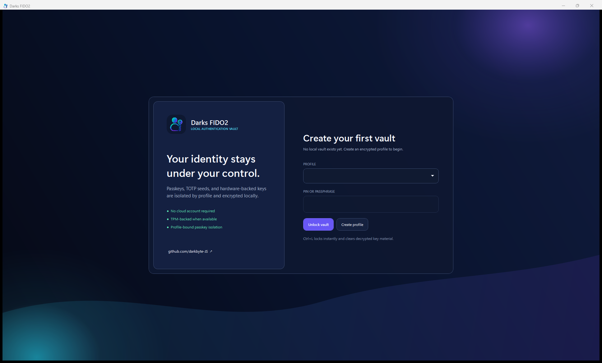

<p align="center">
  
</p>

# Darks FIDO2

Open-source Windows 11 FIDO2/WebAuthn authenticator with TPM-backed keys, local passkeys, and TOTP.

[](https://github.com/darkbyte-JS/DarksFIDO2/actions/workflows/ci.yml)
[](https://github.com/darkbyte-JS/DarksFIDO2/releases)
[](LICENSE)
[](docs/COMPATIBILITY.md)

> [!WARNING]
> **Experimental beta.** Current downloads are self-signed, have no SmartScreen reputation, and have not received an independent security audit. Use disposable test accounts, verify SHA-256 checksums, and read the [known limitations](docs/KNOWN-LIMITATIONS.md) before trusting a real account.

[Download beta](https://github.com/darkbyte-JS/DarksFIDO2/releases) · [Quick start](#quick-start) · [Security model](docs/THREAT-MODEL.md) · [Compatibility](docs/COMPATIBILITY.md) · [Report a vulnerability](https://github.com/darkbyte-JS/DarksFIDO2/security/advisories/new)



## What it does

- Acts as a Windows plugin passkey manager for browser/app WebAuthn create and get requests.
- Creates a separate non-exportable ES256 key per virtual passkey, preferring TPM 2.0 and falling back to Microsoft Software KSP.
- Keeps local passkey records, TOTP seeds, TPM-key metadata, backups, and signed audit history inside independent encrypted profiles.
- Supports Windows Hello and external USB/NFC/BLE authenticators through the Windows WebAuthn API.

## Why it is different

- **Profile-bound credentials:** the provider fails closed without a live unlocked profile and cannot reuse another profile's credential.
- **Local-first:** no account, cloud sync, telemetry, update call, or secret-bearing network path.
- **Windows-native integration:** Windows launches the packaged provider only for WebAuthn requests and Windows Hello remains mandatory for user verification.
- **Transparent security limits:** self-signed status, software fallbacks, pending website confirmation, and incomplete test coverage are shown rather than hidden.

## Quick start

Requirements: Windows 11 24H2 or later, x64, and Windows Hello configured. TPM 2.0 is recommended but not mandatory.

1. Open the [latest pre-release](https://github.com/darkbyte-JS/DarksFIDO2/releases) and verify the matching entry in `SHA256SUMS.txt`.
2. For the full provider path, deliberately trust the attached **public development certificate** in the current user's Trusted People store, then run `DarksFIDO2-Setup.exe`. Setup never changes certificate trust itself.
3. Open Settings > Accounts > Passkeys > Advanced options and enable Darks FIDO2 once.
4. Create and unlock a profile. Use a keyfile only if you can keep both it and the recovery code safely.
5. On a disposable test account, register a passkey and select Darks FIDO2 when Windows asks where to save it.
6. Confirm the website saved the passkey. If the website failed, remove the pending local credential only after verifying it is absent from the account.

The portable ZIP runs the manager but cannot install the packaged Windows provider by itself. It also lacks Program Files write protection.

## Trust and verification

| Document | Purpose |
|---|---|
| [Threat model](docs/THREAT-MODEL.md) | Assets, boundaries, attacker actions, and residual risks |
| [Compatibility](docs/COMPATIBILITY.md) | Windows, TPM, browser, and hardware test matrix |
| [Known limitations](docs/KNOWN-LIMITATIONS.md) | Distribution, provider, key-management, and test gaps |
| [Architecture](docs/ARCHITECTURE.md) | Component/data-flow overview |
| [Security policy](SECURITY.md) | Private reporting and supported versions |
| [Security audit](SECURITY-AUDIT-0.6.2.md) | Focused maintainer review of CTAP CBOR and Windows WebAuthn |
| [Checksums and SBOM](https://github.com/darkbyte-JS/DarksFIDO2/releases) | Per-release SHA-256 file and SPDX dependency inventory |

Security-sensitive behavior includes profile-bound HKDF/AES-GCM protection, PBKDF2-HMAC-SHA-256 at 600,000 iterations, DPAPI/TPM wrapping, canonical bounded CTAP2 CBOR, strict native-buffer validation, required UP/UV, local ES256 assertion verification, zeroing of unlocked key arrays, durable protected-file replacement, and transactional keyfile/install flows. See the threat model for what these controls do not protect.

## Current validation

- Release solution builds with zero warnings and errors.
- 22 hardware/security regression tests pass locally on an Infineon TPM 2.0.
- The Edge browser suite completes `navigator.credentials.create()` and `get()` using CTAP2, resident credentials, and required user verification.
- Locked NuGet dependencies are scanned for known direct and transitive vulnerabilities in CI.

The browser smoke test uses Chromium's virtual authenticator; it does not replace clean-machine MSIX/provider, UI, or multi-vendor hardware testing. Those gaps are tracked in [Compatibility](docs/COMPATIBILITY.md).

## Build and test

Requirements: Windows 11 x64 and the .NET 10 SDK selected by `global.json`.

```powershell
dotnet restore DarksFIDO2.slnx --locked-mode
dotnet build DarksFIDO2.slnx -c Release --no-restore
dotnet run --project tests\DarksFIDO2.Tests\DarksFIDO2.Tests.csproj -c Release --no-build
dotnet run --project tests\DarksFIDO2.BrowserTests\DarksFIDO2.BrowserTests.csproj -c Release --no-build
```

Signed release builds additionally require Windows SDK `makeappx.exe`, `signtool.exe`, and a code-signing key already protected in a Windows certificate store. See [BUILDING.md](BUILDING.md).

## Contributing

The most useful early contributions are compatibility reports, installer/provider testing, accessibility work, reproducible builds, documentation, and focused security review. Start with [CONTRIBUTING.md](CONTRIBUTING.md), the [good first issues](https://github.com/darkbyte-JS/DarksFIDO2/labels/good%20first%20issue), or [Discussions](https://github.com/darkbyte-JS/DarksFIDO2/discussions).

Created and maintained by [darkbyte-JS](https://github.com/darkbyte-JS). See [CONTRIBUTORS.md](CONTRIBUTORS.md).

## Release history and license

Release history is maintained in [CHANGELOG.md](CHANGELOG.md).

Copyright 2026 darkbyte-JS and contributors. Licensed under the [Apache License, Version 2.0](LICENSE), including its contributor patent grant and warranty/liability terms.
