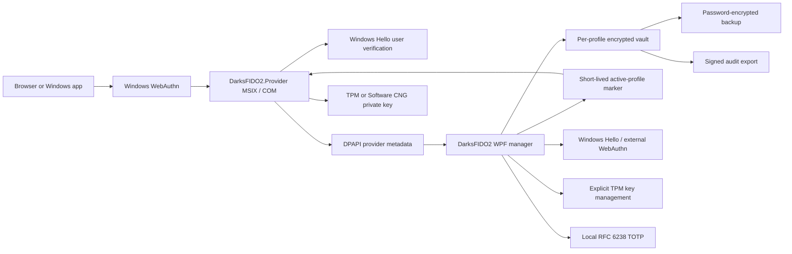

# Architecture

## Components

- `DarksFIDO2.App`: WPF profile, passkey, TOTP, TPM, backup, and audit interface.
- `DarksFIDO2.Core`: encryption, validation, storage, CTAP CBOR, Windows WebAuthn, TPM/CNG, and provider-store logic.
- `DarksFIDO2.Provider`: Windows plugin authenticator invoked for passkey create/get requests.
- `DarksFIDO2.Cli`: bounded, read-only inventory bridge to an already-unlocked GUI profile.
- `DarksFIDO2.Setup`: payload verification, Program Files installation, provider MSIX deployment, rollback, shortcuts, and uninstall.

## Profile isolation

The GUI refreshes a short-lived, DPAPI-protected active-profile marker while a profile remains unlocked. The provider fails closed without a valid live marker and includes the active profile ID in every credential lookup. Provider records and encrypted dashboard records are both bound to that profile ID.

## Cryptographic storage

Each profile receives a random 256-bit master key. A PBKDF2-HMAC-SHA-256 factor derived from the PIN and per-profile salt wraps that master key; an optional random keyfile is mixed through HKDF. The wrapped material is protected by a TPM 2.0 RSA key when available, otherwise by DPAPI CurrentUser. Vault content uses AES-256-GCM plus an independent HMAC-SHA-256 envelope check.

Provider credentials use a distinct non-exportable ES256 key per credential. The TPM KSP is preferred; Microsoft Software KSP is the fallback. Only public material and namespaced provider-key identifiers are stored in metadata.
